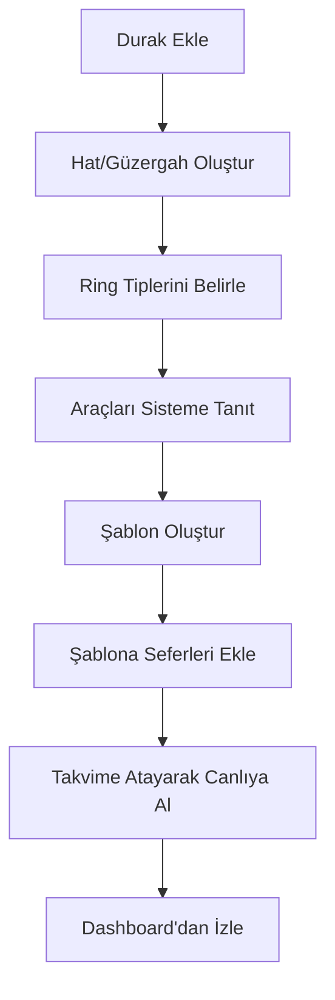

# Ring Planner: Sistem İşleyiş Kılavuzu (akis.md)

Bu doküman, Ring Planner sisteminin mantıksal yapısını, veri modelleri arasındaki ilişkileri ve bir operatörün sistemi kullanırken izlemesi gereken adımları özetler.

---

## 1. Temel Bileşenler ve İlişkiler

Sistem dört ana katmandan oluşur. Her katman bir sonrakinin temelini oluşturur.

### A. Altyapı (Infrastructure)
*   **Duraklar (Stops):** Harita üzerindeki fiziksel noktalardır. Her durağın bir adı ve GPS koordinatı vardır.
*   **Hatlar (Routes):** Belirli bir sırayla dizilmiş duraklar bütünüdür. Bir hat, aracın hangi yolu izleyeceğini belirler.

### B. Araç ve Tip Yönetimi
*   **Ring Tipleri:** Araçların kategorilerini (Örn: Büyük Otobüs, Shuttle, VIP) ve bu kategorilerin sahip olduğu özellikleri (Renk, varsayılan rota vb.) tanımlar.
*   **Araçlar (Devices):** Sistemde kayıtlı fiziksel araçlardır. Her araç bir "Ring Tipi"ne bağlıdır ve bir plakası (veya ID'si) vardır.

### C. Planlama (Templates)
*   **Şablonlar:** Tekrar eden operasyonel taslaklardır (Örn: "Hafta İçi Sabah Programı").
*   **Şablon İşleri (Jobs):** Şablonun içindeki her bir sefer kaydıdır. Hangi saatte, hangi araçla, hangi rotada ve hangi ring tipiyle sefer yapılacağını tanımlar.

### D. Operasyon (Live Schedules)
*   **Sefer Planlama (Schedules):** Şablonların takvime dökülmüş halidir. Belirli bir tarihte (Örn: 25 Şubat 2026) gerçekleşen gerçek seferlerdir.

---

## 2. Kullanıcı Akış Diyagramı

Sistemi kullanmaya başlarken izlenecek ideal yol şöyledir:

---

## 3. Sayfalar Arası İlişki Matrisi

| Sayfa | Ne İş Yapar? | Neye İhtiyaç Duyar? | Bir Sonraki Adım |
|-------|--------------|---------------------|------------------|
| **Duraklar** | Noktaları belirler | Koordinat bilgisi | Hat Yönetimi |
| **Hatlar** | Güzergah çizer | Duraklar | Şablonlar |
| **Ring Tipleri** | Araç gruplarını ayırır | - | Araçlar |
| **Araçlar** | Plakaları kaydeder | Ring Tipleri | Şablonlar |
| **Şablonlar** | Plan taslağı hazırlar | Hatlar, Araçlar, Ring Tipleri | Sefer Planlama |
| **Sefer Planlama** | Canlı operasyonu yönetir | Şablonlar | Dashboard |

---

## 4. Kritik Kurallar ve Notlar

1.  **Bağımlılık Zinciri:** Bir durağı silmek için o durağın hiçbir "Hat" içinde kullanılmıyor olması gerekir. Aynı şekilde, bir "Hat"ı silmek için o hattın hiçbir "Şablon"da kullanılmıyor olması gerekir.
2.  **Otomatik Rota:** Şablonlara sefer eklerken, seçtiğiniz **Ring Tipi**ne atanmış varsayılan bir rota varsa, sistem bunu otomatik olarak getirir.
3.  **Esneklik:** Şablonlar "ideal" planlardır. Sefer Planlama sayfasında bu planlar üzerinde o güne özel (araç arızası vb. durumlarda) değişiklik yapılabilir.
4.  **Görsel Ayrım:** Sistemdeki renkler (Ring Tipleri üzerinden atanır) hem Şablonlarda hem de Dashboard'da araçları birbirinden hızlıca ayırmanızı sağlar.

---

*Bu kılavuz, deploy öncesi sistemin genel mantığını anlamak için temel referanstır.*
